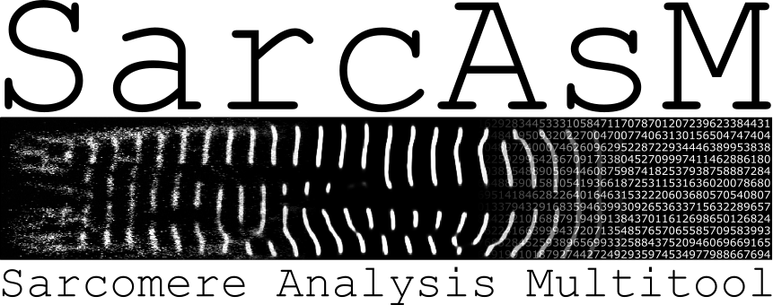

### A Python package for comprehensive analysis of sarcomere structure and function

[](https://python.org)
[](https://pypi.org/project/SarcAsM)
[](https://pypistats.org/packages/SarcAsM)
[](https://en.wikipedia.org/wiki/Software_release_life_cycle#Alpha)
[](https://zenodo.org/badge/latestdoi/xxxxxx)

SarcAsM is an advanced Python package designed to analyze the structure and dynamics of sarcomeres in cardiomyocytes. By leveraging machine learning techniques, SarcAsM provides automated, fast, and unbiased assessments of sarcomeric Z-bands, sarcomeres, myofibrils, and sarcomere domains. Furthermore, SarcAsM tracks and analyzes the motion of individual sarcomere ~20 nm superresolution.
## Installation

### Installation of Python package

For more experienced users or developers, SarcAsM can be installed via pip or directly from GitHub. This method requires a Python environment and Git.

#### Create environment
```sh
conda create -y -n sarcasm-env python=3.9
conda activate sarcasm-env
```

#### Installation via PyPI (available upon publication):
```sh
pip install sarcasm
```

#### Installation from GitHub (available upon publication):
```sh
pip install git+https://github.com/danihae/sarcasm.git
```

#### For reviewers (local directory):
Make sure Python (>=3.9) is installed and/or create environment (see above). 
1. [Download SarcAsM](https://e.pcloud.link/publink/show?code=kZUVoTZeXydDUIgTvJkRhDxLlheNp2G87w7).
2. Install requirements by running ``pip install -r requirements.txt`` in console from sarcasm directory.
4. Add SarcAsM package path to system path and test import. 
```python
import sys

# Determine the path to your local SarcAsM directory
package_path = "/path/to/sarcasm/"

# Add the path to the system path
sys.path.append(package_path)

# Test: import the SarcAsM module or package from the local directory
from sarcasm import *
```
The full installation usually takes less than 5 min, depending on internet connection. For computers equipped with an NVIDIA GPU, make sure the Pytorch and CUDA toolkit versions match.

## Usage

A detailed online documentation with tutorials and examples can be found [here](https://filedn.eu/lKfS794F9UgX7PDuBQcfChB/SarcAsM_docs/).
A data set for testing is available in the folder 'test_data'.

### Standalone application with GUI (beta version)
The app can be started by executing `sarcasm/app/__main__.py` or running `python -m app` from the SarcAsM root directory.

### Python package
After installation, SarcAsM is imported by ``from sarcasm import *``. If SarcAsM is in a local directory, add the path to the system path (see above). 
Examples and tutorials can be found under 'docs/notebooks' and in the [online documentation](https://filedn.eu/lKfS794F9UgX7PDuBQcfChB/SarcAsM_docs/). 

## Support

If you encounter any issues or have any questions about using SarcAsM, please [open an issue](link-to-issue-tracker) on our GitHub repository.

## Citation

If you use SarcAsM in your research, please cite our paper:

[insert citation here upon publication]
