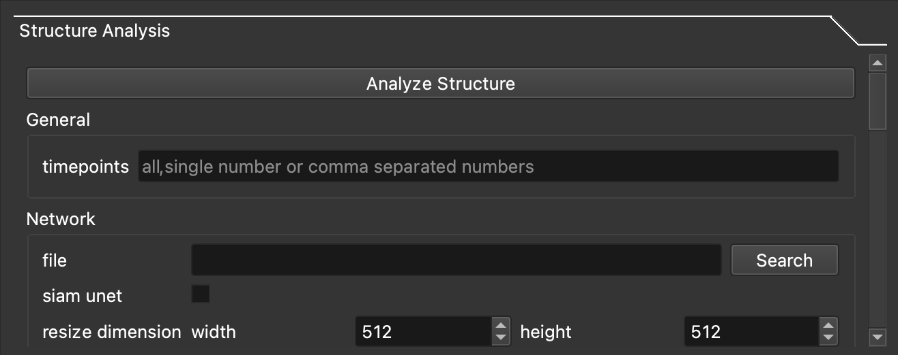
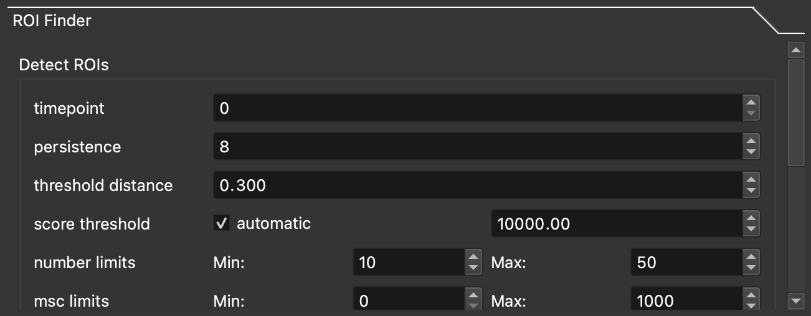

================================
GUI Usage
================================

The `Napari image browser <https://napari.org/stable/index.html>`_ is a large part of SarcAsM's GUI interface. If you used any image editing softare such as Photoshop and GIMP, the interface of Napari should be familiar to you. Check out `this page <https://napari.org/stable/tutorials/fundamentals/viewer.html>`_ for a primer on Napari's GUI.

Starting the GUI
================================

First, remember to activate your installation environment::

    conda activate sarcasm

If you installed through pip, run this inside of your terminal::

    python -m sarcasm

.. todo::
    test this

If you installed through GitHub, run this inside root directory of cloned repo::

    python sarcasm/__main__.py

Analyzing a movie with the GUI
==============================================

1. Load image
------------------------

#. Use the **File Selector** section to load your TIFF image. Click on the **Search** button navigate to it in your file system.

    .. image:: images/file-selection.png

    |

    .. Note::

        A folder with the same name as your image will be created in the same directory containing the image. This folder will contain all the analysis data. Click the **Open Cell Folder** button in the **File Selector** section to directly navigate into this folder. We will refer to this folder as the *cell folder*.

#. Once you specify your TIFF file, an image browser window (Napari) should pop up. You can scroll the bottom slider to navigate your movie. Notice from the panel on the left there are two layers: **Raw** and **ROI**, which is completely empty at this time.

#. Now back in the main GUI window, specify the correct **Metadata**. Once you are done, click **Store Metadata** to write to the cell folder.

#. The **Parameters Import/Export** section saves and exports the parameters you specify in all the following panels. Save often while you are doing analysis with the later panels.

#. Finally, the **Export Data** button exports all the possible data generated by the following panels. A copy of data from all running analysis is stored in the cell folder, but this panel just makes it more convenient.

2. Structural analysis
------------------------

.. Note::
    Scroll your mouse inside this panel to reveal all the features and parameters.

.. todo::
    The z-band analysis documentation does not match up with what is in the GUI

You can the big **Analyze Structure** button on top to run through all the following sections.

#. **General**: The **frames** field can be used to specify analysis to just a specific subset of the frames in the image. This parameter affects every section in this panel except for the **Network** section.

#. **Network**: This section segments the Z discs from your image with U-Net or Siam U-Net. *Required*: Specify the weights file to the neural network in the **file** field. Check the **siam unet** box if your weights file is for the Siam U-Net, uncheck if otherwise. The segmentation results will be saved to the cell folder after this section is done running. You can view the results in Napari.

#. **Z Band Analysis**: See :meth:`sarcasm.package.sarcasm.SarcAsM.structure.analyze_z_bands`.

#. **Wavelet Analysis**: See :meth:`sarcasm.package.sarcasm.SarcAsM.structure.wavelet_analysis`.

#. **Myofibril Lengths**: See :meth:`sarcasm.package.sarcasm.SarcAsM.structure.analyze_myofibrils`.

.. See the appropriate sections in :mod:`sarcasm.package.motion.Motion` for detailed documentation about the parameters of the last three sections.

3. Structural analysis
------------------------

#. **Detect ROIs**: This panel is for automated detection for ROIs (regions of interest). The detected ROIs will appear on the **ROI** layer in Napari (the image browser). You can manually fix any unsatisfactory detections in Napari. In fact, while not recommended due to its labor intensity, you can also draw all the ROI from scratch in Napari. Finally, when you are satisfied with the ROIs, scroll down to **Store ROI Data**, which saves all the ROIs into the cell folder.

    .. todo::
        Documentation for this method.