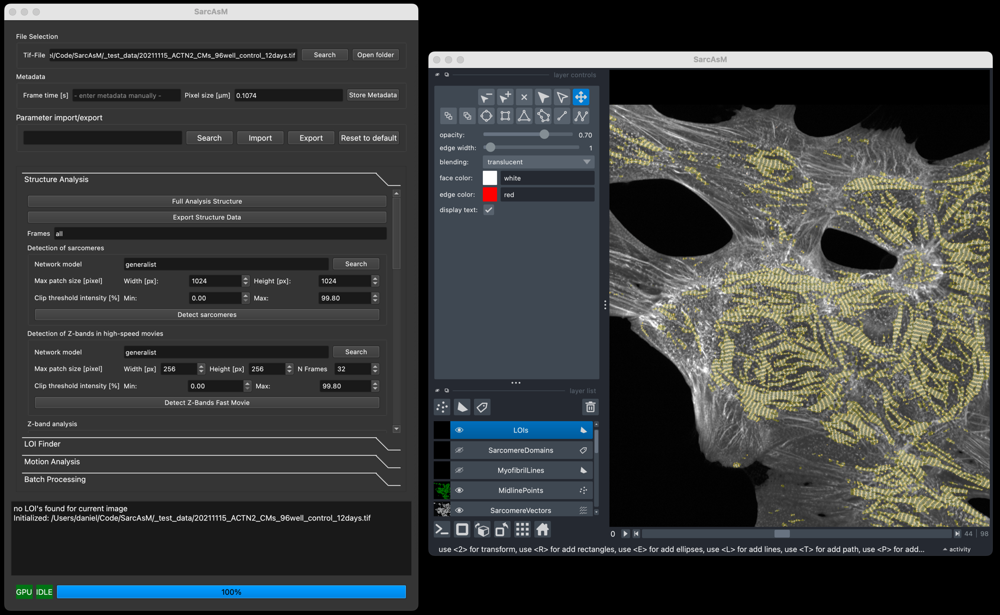

================================
GUI Usage
================================

SarcAsM's GUI application uses `Napari image browser <https://napari.org/stable/index.html>`_ as image viewer. Check out `this page <https://napari.org/stable/tutorials/fundamentals/viewer.html>`_ for a primer on Napari's GUI.

Starting the App
================

First, remember to activate your installation environment::

    conda activate sarcasm

To start the app, run this inside the root directory of SarcAsM::

    python -m sarcasm_app

Using the App
=============

The SarcAsM GUI integrates controls (left panel) with a Napari image viewer (right panel). Follow the steps in the control panel sections for analysis.

**Initial Steps:**

1.  **Load File:** Use **Search** in **File Selection** to load a grayscale TIFF file.
2.  **Set Metadata:** In **Metadata**, check the **Pixel size [µm]**. If the field is red or incorrect, enter the correct value and press **Store Metadata**.

**Analysis Sections:**

Proceed through the collapsible sections in the control panel:

*   **Parameter import/export:** Load/save analysis settings or reset to defaults.
*   **Structure Analysis:** Analyze sarcomere structure.
*   **LOI Finder:** Find and/or draw Lines of Interest (requires structure results).
*   **Motion Analysis:** Analyze sarcomere motion in LOIs.
*   **Batch Processing:** Process multiple files automatically.

**Using Parameters:**

*   **Tooltips:** Hover over parameter names/fields for descriptions.
*   If needed, optimize settings within each section before running the corresponding analysis step (e.g., clicking **Detect sarcomeres**).
