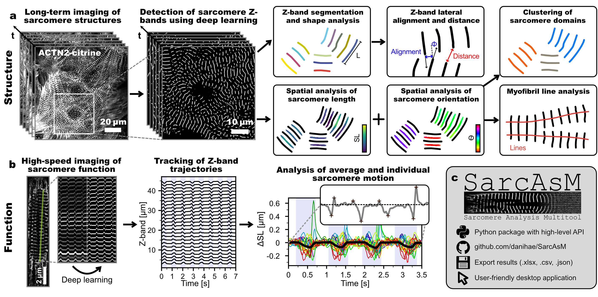

.. SarcAsM documentation master file, created by
   sphinx-quickstart on Sat Nov 12 10:52:00 2022.
   You can adapt this file completely to your liking, but it should at least
   contain the root `toctree` directive.

SarcAsM: AI-Powered Sarcomere Analysis
=======================================

   Graphical overview of SarcAsM's capabilities. *Top:* Multi-level structural analysis of sarcomere architecture. *Bottom:* High-precision tracking and analysis of individual and average sarcomere motion.

SarcAsM (Sarcomere Analysis Multitool) is an AI-powered Python package dedicated to the comprehensive analysis of cardiomyocyte sarcomere structure and function. It empowers researchers by enabling precise, multi-level assessment of sarcomeres from microscopy images and movies. This makes SarcAsM an invaluable tool for diverse applications, including drug screening, disease phenotyping, and fundamental biomechanical studies.

Key Features
------------

SarcAsM comes packed with features designed for comprehensive sarcomere analysis:

*   **AI-Driven Detection:** Robustly identifies sarcomere features in microscopy images using advanced AI.
*   **In-Depth Structural Analysis:** Provides a multi-level examination of sarcomere architecture, including:

    *   Z-band morphometrics and lateral alignment.
    *   Sarcomere lengths and orientations (sarcomere 'vectors').
    *   Myofibril characteristics (length, shape).
    *   Cell-level myofibril domain organization.
*   **Precision Motion Tracking:** Tracks individual and average sarcomere motion with exceptional accuracy (~20 nm).
*   **Dynamic Functional Insights:** Facilitates detailed analysis of sarcomere contraction and relaxation dynamics.
*   **Intuitive Standalone Application:** Offers an easy-to-use app with an interactive Graphical User Interface (GUI), no coding required.
*   **Versatile Python API:** Includes a comprehensive Python API for custom script development and integration into existing analysis pipelines.
*   **Efficient Batch Processing:** Streamlines high-throughput studies with powerful batch processing capabilities.

Using SarcAsM
-------------

SarcAsM offers two convenient ways to analyze your data. Choose the one that best fits your workflow:

-   **Python Package:** For maximum flexibility, performance, and integration into custom analysis pipelines, we recommend the Python package:

    ⚙️ `Python Package <https://pypi.org/project/sarc-asm>`_

    *   Ideal for programming-affine users, **handling large datasets, and achieving faster processing speeds**, especially when leveraging GPU acceleration (if available).
    *   Provides a high-level API for scripting and advanced analysis.

-   **Standalone Application:** For a user-friendly experience with a graphical interface, download our ready-to-use application:

    💾 `Download App (Windows/MacOS) <https://github.com/danihae/SarcAsM/releases>`_

    *   **Note:** The standalone application is great for getting started quickly. However, it may take some time to start up initially. The Windows version currently processes data using the CPU and does not support CUDA for GPU acceleration.

Publication and Citation
------------------------

For a detailed description of SarcAsM, its validation, and example applications, please refer to our preprint. If you use SarcAsM in your research, we kindly ask you to cite this publication:

Haertter, D., Hauke, L., Driehorst, T., Nishi, K., Long, J., Tiburcy, M., Berecic, B., et al. (2025). SarcAsM: AI-Based Multiscale Analysis of Sarcomere Organization and Contractility in Cardiomyocytes. *bioRxiv*. `https://doi.org/10.1101/2025.04.29.650605 <https://doi.org/10.1101/2025.04.29.650605>`_

.. toctree::
   :maxdepth: 2
   :caption: Getting Started:

   installation
   quickstart
   gui

.. toctree::
   :maxdepth: 2
   :caption: Tutorials:

   ./notebooks/tutorial_structure_analysis
   ./notebooks/tutorial_motion_analysis
   ./notebooks/tutorial_batch_analysis
   ./notebooks/tutorial_data_export
   ./notebooks/tutorial_data_visualization
   ./notebooks/tutorial_training_data_generation
   ./notebooks/tutorial_training_unet
   ./notebooks/tutorial_training_3dunet
   ./notebooks/tutorial_training_contraction_net

.. toctree::
   :maxdepth: 2
   :caption: Sarcomere features:

   structure_features
   motion_features

.. toctree::
   :maxdepth: 2
   :caption: API reference:

Contact
-------
For questions, requests and issues, please contact us or `open an issue on GitHub <https://github.com/danihae/sarcasm/issues>`_. For bugs, please append a comprehensive error report.

.. _license:

License
------

This software is distributed under a custom license and is patent pending (DE 10 2024 112 939.5).

**Usage Terms:**

*   **Academic and Non-Commercial Use:** The software is free for use in academic research, educational settings, and other non-commercial activities.
*   **Commercial Use:** Commercial use, redistribution, or inclusion in commercial products/services is strictly prohibited without obtaining a separate commercial license.

**Commercial Licensing:**

For inquiries regarding commercial licensing, please contact:

| MBM ScienceBridge GmbH,
| Hans-Adolf-Krebs-Weg 1,
| 37077 Göttingen,
| Germany
| https://sciencebridge.de/en/

**Full License Text:**

The complete terms and conditions are available in the `LICENSE file <https://github.com/danihae/SarcAsM/blob/main/LICENSE>`_ included with this software distribution.

Indices and tables
==================

* :ref:`genindex`
* :ref:`modindex`